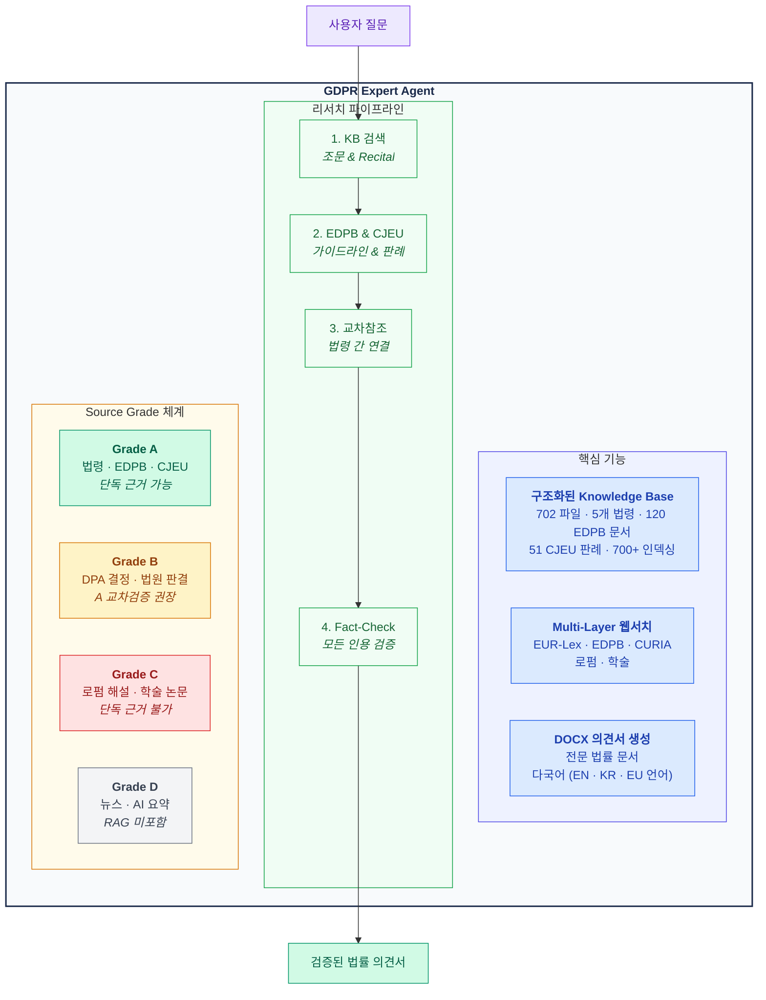
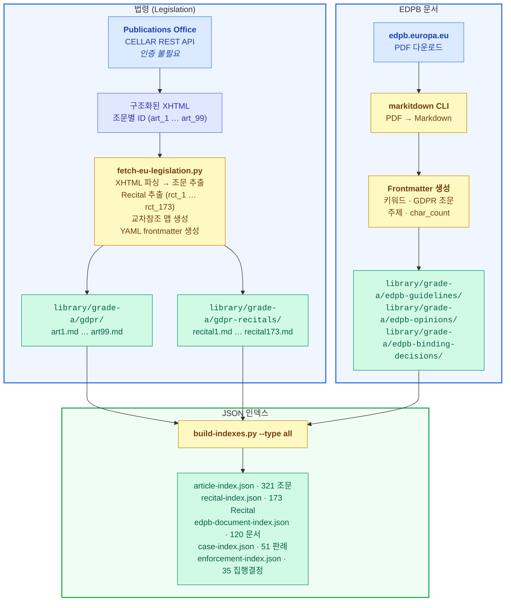
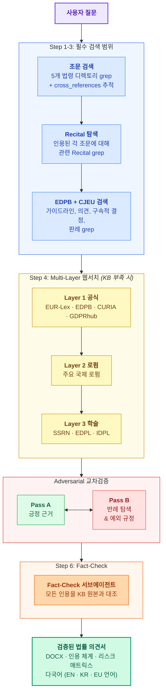

<div align="center">

**[English](README.md)** · **[한국어](#gdpr-expert)**

# GDPR Expert

### AI 기반 EU 데이터 보호법 전문 자문 시스템

**5개 EU 법령** · **321개 조문 + 536개 전문(Recital)** · **120건 EDPB 문서** · **51건 CJEU 판례** · **700+ 인덱싱 항목**

[Claude Code](https://claude.ai/claude-code) 전용 · 구조화된 RAG 기반

[](#-knowledge-base-법령-라이브러리)
[](#-knowledge-base-법령-라이브러리)
[](#edpb-문서--120건-grade-a)
[](#cjeu-판례--51건-grade-a)
[](#집행결정--35건-grade-b)
[](#라이선스)

<br/>

> *"데이터 구조가 곧 지능이다."*
> — 더 똑똑한 검색이 아니라, 더 똑똑한 데이터를 추구합니다.

</div>

> [!CAUTION]
> **본 도구는 법률 리서치 보조 도구이며, 법률 자문을 제공하지 않습니다.** 출력물은 AI가 생성한 것으로, 검증 시스템이 내장되어 있으나 오류가 포함될 수 있습니다. 모든 법령 인용은 실제 활용 전 독립적으로 확인하시기 바랍니다. 구체적 법률 사안에 대해서는 반드시 전문 법률가와 상담하십시오. **[Disclaimer](docs/en/DISCLAIMER.md)** · **[면책사항](docs/ko/DISCLAIMER.md)**

> [!TIP]
> **처음이신가요?** **[사용 가이드](docs/ko/HOW-TO-USE.md)**를 읽어보세요 — 기술 배경 지식이 필요 없습니다. **[How to Use (English)](docs/en/HOW-TO-USE.md)**

---

## 문제 인식

기존 AI 법률 어시스턴트(ChatGPT Custom GPT, Gemini Gem 등)는 EU 법령을 단순 텍스트 문서로 취급합니다. PDF를 업로드하고, 의미 검색을 돌리고, 결과를 기대합니다. 이 방식은 EU 데이터 보호 업무에 **근본적으로 부적합**합니다:

- **전문(Recital)의 해석 권위** — GDPR에는 99개 조문을 해석하기 위해 법원과 DPA가 의존하는 173개 Recital이 있음. 일반 RAG는 이를 연결 없는 단락으로 취급
- **법령 간 교차참조** — GDPR Article 95는 ePrivacy Directive와의 관계를 규율하고, AI Act은 GDPR Art. 22를 교차참조. 5개 법령이 하나의 연결된 그물을 형성
- **소스 권위 계층** — EDPB 구속적 결정(Art. 65)은 법적 효력이 있고, 로펌 뉴스레터는 없음. 일반 RAG는 이를 동일하게 취급
- **인용 검증 가능성** — 모든 법적 인용은 정확한 조항으로 추적 가능해야 함. "GDPR 어딘가에 있음"은 인용이 아님

결과? 환각된 조문 번호, 조작된 CJEU 판결 요지, 어떤 프라이버시 전문가도 신뢰하지 않을 의견서.

---

## 해결 방안

GDPR Expert는 다른 접근을 취합니다: **더 똑똑한 검색 대신, 더 똑똑한 데이터를 구축합니다.**

모든 EU 법률 소스를 **공식 API**에서 수집하고, **조문 단위 구조화 파일**로 파싱하며, **교차참조와 메타데이터**로 보강하고, **JSON 인덱스**로 검색 가능하게 합니다. AI가 추측하지 않습니다 — 실제 법률을 읽습니다.



---

## Knowledge Base (법령 라이브러리)

### 데이터 수집 파이프라인

대부분의 법률 AI 도구는 "PDF 업로드"를 요구합니다. 우리는 공식 EU 소스에서 법령을 직접 가져와 HTML/XML 구조를 파싱하고, 조문 단위 Markdown 파일을 생성하는 **자동화된 파이프라인**을 구축했습니다.



**핵심 설계 선택:** EU Publications Office의 **CELLAR REST API**를 사용합니다 — 웹 스크래핑이 아닙니다. `Accept: application/xhtml+xml` 헤더 하나로 전체 법령 텍스트를 조문별 ID(`art_1`, `art_2`, ... `art_99`)가 포함된 구조화 XHTML로 받을 수 있습니다. 인증 불필요. EUR-Lex 자체를 구동하는 동일한 인프라입니다.

### 법령 — CELLAR API 통한 5개 EU 법률

| 법령 | CELEX | 조문 수 | Recital 수 | 디렉토리 |
|------|-------|--------|-----------|---------|
| **GDPR** (Regulation 2016/679) | 32016R0679 | 99 | 173 | `library/grade-a/gdpr/` |
| **ePrivacy Directive** (2002/58/EC) | 02002L0058-20091219 | 21 | — | `library/grade-a/eprivacy-directive/` |
| **EU AI Act** (Regulation 2024/1689) | 32024R1689 | 113 | 180 | `library/grade-a/eu-ai-act/` |
| **Data Act** (Regulation 2023/2854) | 32023R2854 | 50 | 120 | `library/grade-a/data-act/` |
| **Data Governance Act** (Regulation 2022/868) | 32022R0868 | 38 | 63 | `library/grade-a/data-governance-act/` |
| **합계** | | **321** | **536** | |

> **ePrivacy Directive 참고:** Regulation(규칙)은 EU 전역에 직접 적용되지만, Directive(지침)는 각 회원국이 국내법으로 전환(transposition)해야 합니다. ePrivacy Directive의 쿠키 동의 규정은 EU-27 각국마다 다르게 구현되어 있습니다. 이 KB에는 EU 수준의 Directive 원문이 포함되어 있으며, 각 회원국의 이행 법률은 [Ingest 시스템](#-소스-ingest-시스템)을 통해 추가할 수 있습니다.

### EDPB 문서 — 120건 Grade A

유럽 데이터 보호 이사회(EDPB)의 공식 지침, PDF에서 구조화된 Markdown으로 변환.

| 유형 | 건수 | 주요 문서 |
|------|------|---------|
| **Guidelines** | 52 | Consent (05/2020), Legitimate Interest (01/2024), Territorial Scope (03/2018), DPO (WP243), DPIA (WP248) |
| **Opinions** | 31 | AI Models (28/2024), Consent-or-Pay (08/2024), EU-US DPF (5/2023), SCCs, Adequacy Decisions |
| **Binding Decisions (Art. 65)** | 10 | Meta/WhatsApp 12억 유로, Instagram 4.05억, Facebook 2.1억, TikTok 3.45억 |
| **Recommendations** | 7 | 이전 보충 조치 (01/2020), 유럽 필수 보장 (02/2020) |
| **Statements** | 19 | 연령 확인, AI Act, Digital Omnibus, ePrivacy Regulation |
| **Reports** | 1 | EU-US Data Privacy Framework 첫 번째 리뷰 |

### CJEU 판례 — 51건 Grade A

EU법에서 CJEU 판결은 법령의 **구속력 있는 해석**입니다 — 참고 자료가 아닙니다. 다른 법 체계에서 판례를 Grade B로 분류하는 것과 달리, 이 시스템에서 CJEU가 Grade A인 이유입니다.

<details>
<summary><b>주요 판례 (클릭하여 펼치기)</b></summary>

| 사건 | 주제 | 의의 |
|------|------|------|
| C-131/12 **Google Spain** | 잊힐 권리 | 검색 결과에서의 삭제권 확립 |
| C-311/18 **Schrems II** | 국제 이전 | EU-US Privacy Shield 무효화 |
| C-252/21 **Meta v Bundeskartellamt** | 정당한 이익 | 경쟁당국의 GDPR 준수 평가 가능 |
| C-807/21 **Deutsche Wohnen** | 기업 과징금 | Art. 83 과징금의 기업 과실 요건 명확화 |
| C-634/21 **SCHUFA Scoring** | 자동화된 결정 | 신용 평가 = Art. 22의 자동화된 의사결정 |
| C-604/22 **IAB Europe TCF** | 애드테크 / 동의 | TC 문자열은 개인정보; 애드테크에서의 공동 컨트롤러십 |
| C-673/17 **Planet49** | 쿠키 동의 | 사전 체크된 박스는 유효한 동의가 아님 |
| C-40/17 **Fashion ID** | 공동 컨트롤러 | 웹사이트 운영자 + Facebook = Like 버튼에 대한 공동 컨트롤러 |
| C-300/21 **Osterreichische Post** | 손해배상 | GDPR 위반 자체만으로 자동적 손해배상권 미발생 |

*...그 외 42건: 손해배상, DPO 독립성, 데이터 이동권, 열람권, 정당한 이익 형량, 자동화된 결정 등.*

</details>

### 집행결정 — 35건 Grade B

Meta, Amazon, TikTok, Google, H&M, OpenAI, Clearview AI 등에 대한 주요 DPA 과징금 결정.

### 입법 제안 — Digital Omnibus Package (Grade B)

2025년 11월 EU 집행위원회의 Digital Omnibus Package (COM(2025) 836 + 837)는 AI 개발이 Art. 6(1)(f) legitimate interest에 해당할 수 있음을 명확히 하고, 위반 통지 기준을 변경하며, 쿠키 동의 규율을 ePrivacy에서 GDPR로 이관하는 등 중요한 GDPR 개정안을 포함합니다. Grade B(제안 단계, 아직 법률 아님)로 저장하되, 핵심 변경 사항이 frontmatter에 요약되어 있습니다.

---

## 데이터 구조화 방식

모든 법률 소스는 풍부한 YAML frontmatter를 가진 독립 `.md` 파일로 저장됩니다:

```yaml
---
# === 식별 정보 ===
law: "General Data Protection Regulation"
law_id: "32016R0679"
article: 6
article_title: "Lawfulness of processing"
chapter: "II"
chapter_title: "Principles"

# === 소스 정보 ===
source_grade: "A"
effective_date: "20180525"
retrieved_at: "2026-03-25"

# === 관계 정보 ===
cross_references:
  - "Art. 5(1)(a)"
  - "Art. 9"
  - "Recital 40-50"

# === 검색 메타데이터 ===
keywords:
  - "consent"
  - "lawful"
  - "legitimate interest"
---

## Article 6 — Lawfulness of processing

1.   Processing shall be lawful only if and to the extent
that at least one of the following applies...
```

이를 통해 AI 에이전트는:

- JSON 인덱스 파일로 **키워드 검색** — 700+ 파일을 무차별 검색하지 않음
- **교차참조 추적** — Art. 6 → Recital 47 → Art. 5(1)(b) → Recital 39
- Grade 체계로 **소스 권위 검증** — Grade A 인용이 Grade B보다 무게 있음
- **정확한 조문 원문 읽기** — 텍스트가 파일에 있으므로 환각 없음

---

## 동작 방식



### 인용 검증 태그

| 태그 | 의미 |
|------|------|
| `[VERIFIED]` | KB의 Grade A 소스에서 정확히 매칭 |
| `[UNVERIFIED]` | Grade B만 존재하거나 부분 일치 |
| `[INSUFFICIENT]` | 근거 부족 — 추측하지 않고 빈칸 |
| `[CONTRADICTED]` | 소스 간 모순 — 양쪽 모두 제시 |

---

## Fact-Check 레이어 (환각 방지)

최종 출력 전, **전용 fact-checker 서브에이전트**가 모든 법령 인용을 KB 원본과 대조합니다:

| 검증 항목 | 방법 | 실패 시 |
|----------|------|--------|
| 조문 존재 여부 | KB에서 `art{N}.md` Glob | `[UNVERIFIED]`로 다운그레이드 |
| 인용 원문 일치 | 파일 Read 후 대조 | 올바른 원문으로 교체 |
| 조문 번호 정확성 | frontmatter 대조 | 번호 정정 |
| Recital-Article 정합성 | Recital의 `related_articles` 필드 | 약한 연결 표시 |
| EDPB/CJEU 인용 존재 | 해당 KB 디렉토리 검색 | 다운그레이드 또는 삭제 |
| 교차참조 유효성 | 대상 파일 존재 확인 | 깨진 참조 표시 |
| 웹소스 신뢰도 | 신뢰 도메인 목록 대조 | Grade 다운그레이드 |

**신뢰도 임계값:** 70% 미만이면 FAIL 항목을 수정하고 재검증 후 출력합니다. 핵심 결론에 영향을 주는 인용은 검증 없이 출력하지 않습니다.

---

## 소스 Ingest 시스템

### 나만의 소스 추가하기

Knowledge base는 성장하도록 설계되었습니다. 국내 이행 법률, 관할권의 DPA 결정, 내부 가이던스 — 무엇이든 추가할 수 있습니다.

```
library/inbox/    <-- 아무 파일이나 드롭 (PDF, DOCX, HTML 등)
     |
     v  에이전트에게: /ingest 또는 "inbox에 파일 넣었어"
     |
     |-- 1. 자동 변환 (MarkItDown CLI)
     |       지원: PDF, DOCX, PPTX, HTML, XLSX, 이미지
     |
     |-- 2. Grade 자동 판별 (내용 분석 기반)
     |       Grade A: 공식 소스 (eur-lex.europa.eu, edpb.europa.eu, 각국 DPA 도메인)
     |       Grade B: 법원 결정, DPA 집행결정
     |       Grade C: 로펌 해설, 학술 논문 (SSRN, 저널)
     |       Grade D: 뉴스, AI 요약 -> 경고와 함께 거부
     |
     |-- 3. Frontmatter 자동 생성
     |       추출: 제목, 발행자, 날짜, 키워드, 관련 GDPR 조문
     |
     |-- 4. 적절한 디렉토리에 자동 배치
     |       library/grade-a/{카테고리}/ 또는 grade-b/ 또는 grade-c/
     |
     '-- 5. 검색 인덱스 자동 업데이트
            JSON 인덱스 재빌드 → 새 콘텐츠 즉시 검색 가능
```

### Ingest 활용 시나리오

| 시나리오 | 추가할 자료 | 배치 위치 |
|---------|-----------|---------|
| **ePrivacy 국내 이행법** | 각국 전환법 (예: 독일 TTDSG, 프랑스 CNIL 지침) | Grade A |
| **최근 DPA 결정** | 각국 DPA 웹사이트의 PDF | Grade B |
| **내부 가이던스** | 조직의 데이터 보호 정책 | Grade B/C |
| **학술 논문** | SSRN 또는 법학 저널의 PDF | Grade C |

> **참고:** 파일을 넣는 것만으로는 자동 처리되지 않습니다. `/ingest`를 실행하거나 에이전트에게 알려줘야(예: "inbox에 파일 넣었어") 파싱 파이프라인이 시작됩니다.

---

## 시작하기

### 사전 요구사항

- [Claude Code](https://claude.ai/claude-code) CLI
- Python 3.10+
- `python-docx` (`pip install python-docx`)
- `markitdown` (PDF ingest용: `pip install markitdown`)

### 설치

```bash
git clone https://github.com/kipeum86/GDPR-expert.git
cd GDPR-expert
pip install python-docx markitdown
```

### 법령 데이터 갱신

```bash
# CELLAR API에서 5개 EU 법령 전부 수집 (인증 불필요)
python3 scripts/fetch-eu-legislation.py

# 특정 법령만 수집
python3 scripts/fetch-eu-legislation.py --law gdpr

# 데이터 변경 후 검색 인덱스 재빌드
python3 scripts/build-indexes.py --type all
```

### 에이전트 실행

```bash
cd GDPR-expert
claude --agent .claude/agents/gdpr-agent.md
```

### 예시 질문

```
"AI 모델 학습에 Art. 6(1)(f) legitimate interest를 적용할 수 있는지 분석해 줘"
"SCHUFA 사건에서 CJEU가 자동화된 의사결정에 대해 뭐라고 했어?"
"GDPR vs Digital Omnibus 제안의 위반 통지 요건 비교해 줘"
"미국으로의 국제 데이터 이전에 대한 법률의견서 작성해 줘 — DOCX, 영어+한국어"
"Meta에 대한 EDPB 구속적 결정들과 부과된 과징금은?"
```

---

## 법무법인 진주 (Jinju Law Firm)

**법무법인 진주** 소속 전문 법률 AI 에이전트 시리즈:

| 에이전트 | 변호사 | 전문 분야 |
|---------|--------|----------|
| [game-legal-research](https://github.com/kipeum86/game-legal-research) | 심진주 | 게임 산업법 |
| [legal-translation-agent](https://github.com/kipeum86/legal-translation-agent) | 변혁기 | 법률 번역 |
| [general-legal-research](https://github.com/kipeum86/general-legal-research) | 김재식 | 법률 리서치 |
| [PIPA-expert](https://github.com/kipeum86/PIPA-expert) | 정보호 | 개인정보보호법 (PIPA) |
| **[GDPR-expert](https://github.com/kipeum86/GDPR-expert)** | **김덕배** | **데이터 보호법 (GDPR)** |
| [contract-review-agent](https://github.com/kipeum86/contract-review-agent) | 고덕수 | 계약서 검토 |
| [legal-writing-agent](https://github.com/kipeum86/legal-writing-agent) | 한석봉 | 법률 문서 작성 |
| [second-review-agent](https://github.com/kipeum86/second-review-agent) | 반성문 | 품질 리뷰 (파트너) |

---

## 라이선스

Apache 2.0

---

<div align="center">
<sub>임베딩에 대한 맹신이 아니라, 구조화된 데이터 위에 세워졌습니다.</sub>
<br/>
<sub>다른 프로젝트 보기: <a href="https://kipeum86.github.io/github-folio/">kipeum86.github.io/github-folio</a></sub>
</div>
