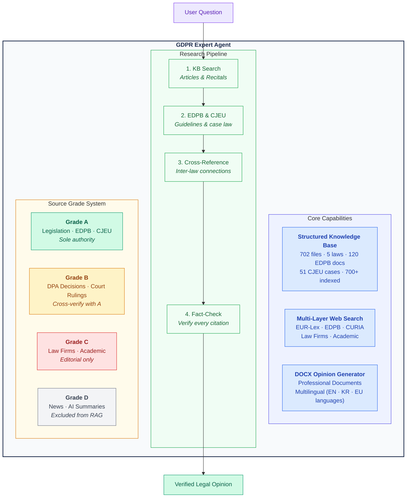
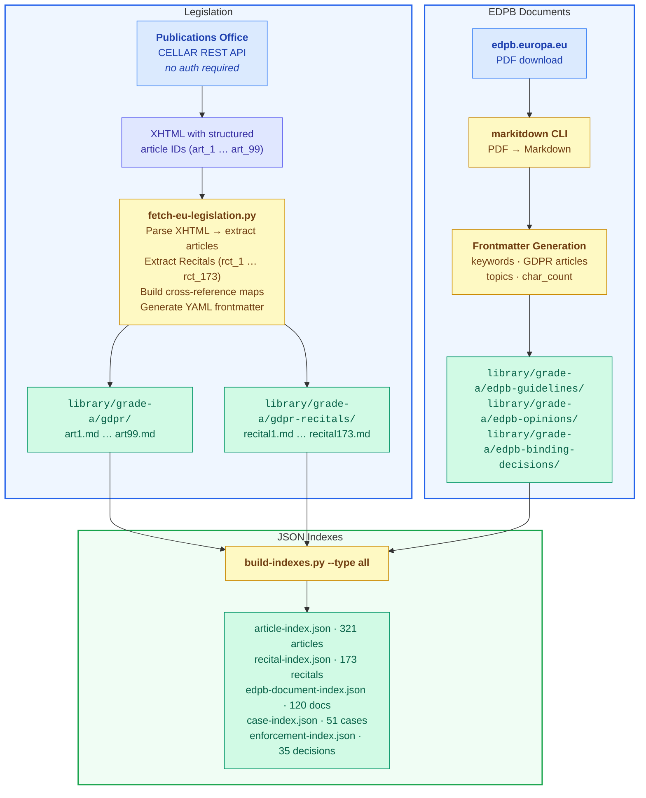
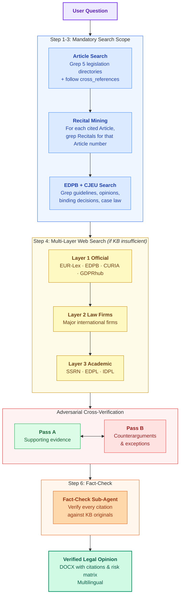

<div align="center">

**[English](#gdpr-expert)** · **[한국어](README.ko.md)**

# GDPR Expert

### AI-Powered EU Data Protection Law Advisor

**5 EU laws** · **321 articles + 536 recitals** · **120 EDPB documents** · **51 CJEU cases** · **700+ indexed items**

Built for [Claude Code](https://docs.anthropic.com/en/docs/claude-code/overview) · Powered by structured RAG

[](#-knowledge-base)
[](#-knowledge-base)
[](#edpb-documents--120-grade-a-sources)
[](#cjeu-case-law--51-grade-a-judgments)
[](#enforcement-decisions--35-grade-b-sources)
[](#license)

<br/>

> *"Data structure is intelligence."*
> — Smarter data beats smarter search. Every time.

</div>

> [!CAUTION]
> **This tool is for legal research assistance only — it does not provide legal advice.** Outputs are AI-generated and may contain errors despite built-in verification. All legal citations should be independently verified before reliance. Consult a qualified attorney for advice on specific legal matters. **[Full Disclaimer](docs/en/DISCLAIMER.md)** · **[면책사항](docs/ko/DISCLAIMER.md)**

> [!TIP]
> **New here?** Read the **[How to Use Guide](docs/en/HOW-TO-USE.md)** — no technical background required. **[사용 가이드 (한국어)](docs/ko/HOW-TO-USE.md)**

---

## The Problem

Existing AI legal assistants (ChatGPT Custom GPTs, Gemini Gems, etc.) treat EU legislation as flat text documents. They upload PDFs, run semantic search, and hope for the best. This approach **fundamentally fails** for EU data protection work because it ignores:

- **Recitals as interpretive authority** — GDPR has 173 Recitals that courts and DPAs rely on to interpret the 99 Articles. Flat-text RAG treats them as disconnected paragraphs
- **Cross-legislation references** — GDPR Article 95 governs the relationship with the ePrivacy Directive; the AI Act cross-references GDPR Art. 22. Five laws form an interconnected web
- **Source authority hierarchy** — an EDPB binding decision (Art. 65) carries legal force; a law firm newsletter does not. Generic RAG treats them identically
- **Citation verifiability** — every legal citation must trace back to an exact provision. "Somewhere in the GDPR" is not a citation

The result? Hallucinated article numbers, fabricated CJEU case holdings, and opinions that no privacy professional would rely on.

---

## The Solution

GDPR Expert takes a different approach: **instead of smarter search, build smarter data.**

Every EU legal source is fetched from **official APIs**, parsed into **article-level structured files**, enriched with **cross-references and metadata**, and made searchable through **JSON indexes**. The AI doesn't guess — it reads the actual law.



---

## Knowledge Base

### How the Data Gets In — The Collection Pipeline

Most legal AI tools ask you to "upload a PDF." We built an **automated pipeline** that fetches legislation directly from official EU sources, parses the HTML/XML structure, and generates per-article Markdown files with rich metadata.



**Key design choice:** We use the EU Publications Office **CELLAR REST API** — not web scraping. A single HTTP request with `Accept: application/xhtml+xml` returns the full legislation text in structured XHTML with article-level IDs (`art_1`, `art_2`, ... `art_99`). No authentication required. No rate limiting issues for our scale. This is the same infrastructure that powers EUR-Lex itself.

### Legislation — 5 EU Laws via CELLAR API

| Law | CELEX | Articles | Recitals | Directory |
|-----|-------|----------|----------|-----------|
| **GDPR** (Regulation 2016/679) | 32016R0679 | 99 | 173 | `library/grade-a/gdpr/` |
| **ePrivacy Directive** (2002/58/EC) | 02002L0058-20091219 | 21 | — | `library/grade-a/eprivacy-directive/` |
| **EU AI Act** (Regulation 2024/1689) | 32024R1689 | 113 | 180 | `library/grade-a/eu-ai-act/` |
| **Data Act** (Regulation 2023/2854) | 32023R2854 | 50 | 120 | `library/grade-a/data-act/` |
| **Data Governance Act** (Regulation 2022/868) | 32022R0868 | 38 | 63 | `library/grade-a/data-governance-act/` |
| **Total** | | **321** | **536** | |

> **Note on the ePrivacy Directive:** Unlike Regulations (which apply directly across the EU), Directives must be transposed into national law by each Member State. The ePrivacy Directive's cookie consent rules, for example, are implemented differently across the EU-27. This KB contains the EU-level Directive text. For Member State-specific implementations, use the [ingest system](#-source-ingest-system) to add national transposition laws to your knowledge base.

### EDPB Documents — 120 Grade A Sources

Official guidance from the European Data Protection Board, converted from PDF to structured Markdown.

| Type | Count | Examples |
|------|-------|---------|
| **Guidelines** | 52 | Consent (05/2020), Legitimate Interest (01/2024), Territorial Scope (03/2018), DPO (WP243), DPIA (WP248) |
| **Opinions** | 31 | AI Models (28/2024), Consent-or-Pay (08/2024), EU-US DPF (5/2023), SCCs, Adequacy Decisions |
| **Binding Decisions (Art. 65)** | 10 | Meta/WhatsApp EUR 1.2B, Instagram EUR 405M, Facebook EUR 210M, TikTok EUR 345M |
| **Recommendations** | 7 | Supplementary Measures for Transfers (01/2020), European Essential Guarantees (02/2020) |
| **Statements** | 19 | Age Assurance, AI Act, Digital Omnibus, ePrivacy Regulation |
| **Reports** | 1 | EU-US Data Privacy Framework First Review |

### CJEU Case Law — 51 Grade A Judgments

In EU law, CJEU judgments are **binding interpretations** of legislation — not secondary commentary. That's why they're Grade A in this system, not Grade B like court decisions in some other legal traditions.

<details>
<summary><b>Notable cases (click to expand)</b></summary>

| Case | Topic | Why It Matters |
|------|-------|---------------|
| C-131/12 **Google Spain** | Right to be forgotten | Established the right to erasure from search results |
| C-311/18 **Schrems II** | International transfers | Invalidated EU-US Privacy Shield |
| C-252/21 **Meta v Bundeskartellamt** | Legitimate interest | Competition authority can assess GDPR compliance |
| C-807/21 **Deutsche Wohnen** | Corporate fines | Clarified corporate fault requirement for Art. 83 fines |
| C-634/21 **SCHUFA Scoring** | Automated decisions | Credit scoring = automated decision-making under Art. 22 |
| C-604/22 **IAB Europe TCF** | Adtech / consent | TC string is personal data; joint controllership in adtech |
| C-673/17 **Planet49** | Cookie consent | Pre-ticked boxes are not valid consent |
| C-40/17 **Fashion ID** | Joint controllership | Website operator + Facebook = joint controllers for Like button |
| C-300/21 **Osterreichische Post** | Damages | Mere GDPR infringement does not equal automatic right to compensation |

*...and 42 more cases covering damages, DPO independence, data portability, right of access, legitimate interest balancing, and more.*

</details>

### Enforcement Decisions — 35 Grade B Sources

Major DPA enforcement actions including fines against Meta, Amazon, TikTok, Google, H&M, OpenAI, and Clearview AI.

### Legislative Proposals — Digital Omnibus Package (Grade B)

The EU Commission's November 2025 Digital Omnibus Package (COM(2025) 836 + 837) proposes significant GDPR amendments — clarifying that AI development may qualify as a legitimate interest under Art. 6(1)(f), raising the breach notification threshold, and migrating cookie consent rules from the ePrivacy Directive into GDPR. Stored as Grade B (proposal, not yet law) with key changes summarized in frontmatter.

---

## How the Data is Structured

Every legal source is stored as a standalone `.md` file with rich YAML frontmatter:

```yaml
---
# === Identification ===
law: "General Data Protection Regulation"
law_id: "32016R0679"
article: 6
article_title: "Lawfulness of processing"
chapter: "II"
chapter_title: "Principles"

# === Source ===
source_grade: "A"
effective_date: "20180525"
retrieved_at: "2026-03-25"

# === Relationships ===
cross_references:
  - "Art. 5(1)(a)"
  - "Art. 9"
  - "Recital 40-50"

# === Search Metadata ===
keywords:
  - "consent"
  - "lawful"
  - "legitimate interest"
---

## Article 6 — Lawfulness of processing

1.   Processing shall be lawful only if and to the extent
that at least one of the following applies...
```

This structure enables the AI agent to:

- **Search by keyword** using JSON index files — not brute-force grep across 700+ files
- **Follow cross-references** — Art. 6 leads to Recital 47, which leads to Art. 5(1)(b), which leads to Recital 39
- **Verify source authority** — Grade A citations carry more weight than Grade B
- **Read exact provisions** — no hallucination, because the text is right there in the file

---

## How It Works



### Citation Verification Tags

| Tag | Meaning |
|-----|---------|
| `[VERIFIED]` | Exact match in Grade A source from KB |
| `[UNVERIFIED]` | Grade B only, or partial match |
| `[INSUFFICIENT]` | Not enough evidence — left blank rather than guessed |
| `[CONTRADICTED]` | Sources conflict — both sides presented |

---

## Fact-Check Layer (Hallucination Prevention)

Before any output is finalized, a **dedicated fact-checker sub-agent** verifies every legal citation against the knowledge base:

| Check | Method | On Fail |
|-------|--------|---------|
| Article exists | Glob for `art{N}.md` in KB | Downgrade to `[UNVERIFIED]` |
| Quoted text matches source | Read file, substring match | Replace with correct text |
| Article number is precise | Frontmatter `article` + `article_title` match | Correct the number |
| Recital-Article alignment | Recital's `related_articles` field | Flag weak connection |
| EDPB/CJEU citation exists | Search respective KB directories | Downgrade or remove |
| Cross-reference is valid | Verify target file exists | Flag broken reference |
| Web source is trusted | Match against trusted domain list | Downgrade Grade |

**Confidence threshold:** If below 70%, FAIL items are corrected and re-verified before output. Citations affecting core conclusions are withdrawn rather than left unverified.

---

## Source Ingest System

### Adding Your Own Sources

The knowledge base is designed to grow. National transposition laws, DPA decisions from your jurisdiction, internal guidance — anything can be added.

```
library/inbox/    <-- drop any file here (PDF, DOCX, HTML, etc.)
     |
     v  Tell the agent: /ingest or "I added files to inbox"
     |
     |-- 1. AUTO-CONVERT to Markdown (via MarkItDown CLI)
     |       Supports: PDF, DOCX, PPTX, HTML, XLSX, images
     |
     |-- 2. AUTO-CLASSIFY Grade (based on content signals)
     |       Grade A: Official sources (eur-lex.europa.eu, edpb.europa.eu, national DPA domains)
     |       Grade B: Court decisions, DPA enforcement decisions
     |       Grade C: Law firm analyses, academic papers (SSRN, journals)
     |       Grade D: News, AI summaries -> REJECTED with warning
     |
     |-- 3. AUTO-GENERATE frontmatter
     |       Extracts: title, publisher, date, keywords, GDPR articles mentioned
     |
     |-- 4. AUTO-PLACE in correct directory
     |       library/grade-a/{category}/ or grade-b/ or grade-c/
     |
     '-- 5. AUTO-UPDATE search indexes
            Rebuilds JSON indexes so new content is immediately searchable
```

### When to Use Ingest

| Scenario | What to Add | Where It Goes |
|----------|------------|-------|
| **National ePrivacy implementation** | Your country's transposition law (e.g., German TTDSG, French CNIL guidance) | Grade A |
| **Recent DPA decision** | PDF from your national DPA's website | Grade B |
| **Internal guidance** | Your organization's data protection policies | Grade B/C |
| **Academic paper** | PDF from SSRN or law journal | Grade C |

> **Note:** Dropping files alone does not trigger processing. You must run `/ingest` or tell the agent (e.g., "I added files to the inbox") to start the pipeline.

---

## Project Structure

```
GDPR-expert/
├── library/
│   ├── inbox/                          # Drop zone for new sources
│   ├── grade-a/                        # Authoritative sources (665 files)
│   │   ├── gdpr/                       #   GDPR articles (99)
│   │   ├── gdpr-recitals/             #   GDPR Recitals (173)
│   │   ├── eprivacy-directive/        #   ePrivacy articles (21)
│   │   ├── eu-ai-act/                 #   AI Act articles (113)
│   │   ├── data-act/                  #   Data Act articles (50)
│   │   ├── data-governance-act/       #   DGA articles (38)
│   │   ├── edpb-guidelines/           #   EDPB Guidelines (52)
│   │   ├── edpb-opinions/            #   EDPB Opinions (31)
│   │   ├── edpb-binding-decisions/   #   Art. 65 Binding Decisions (10)
│   │   ├── edpb-recommendations/     #   EDPB Recommendations (7)
│   │   ├── edpb-statements/          #   EDPB Statements (19)
│   │   ├── edpb-reports/             #   EDPB Reports (1)
│   │   └── cjeu-cases/              #   CJEU Judgments (51)
│   ├── grade-b/                        # Verified secondary (37 files)
│   │   ├── enforcement-decisions/     #   DPA fines & decisions (35)
│   │   └── legislative-proposals/    #   Digital Omnibus Package (2)
│   └── grade-c/                        # Academic papers
├── index/                              # 5 JSON indexes (700+ items)
├── config/                             # Grade definitions + RAG config
├── scripts/                            # Collection & processing scripts
├── .claude/agents/                     # Agent + fact-checker definitions
└── output/opinions/                    # Generated DOCX opinions
```

---

## Getting Started

> **New here?** Read the **[How to Use Guide](docs/en/HOW-TO-USE.md)** — a step-by-step walkthrough for non-developers.

### Prerequisites

- [Claude Code](https://docs.anthropic.com/en/docs/claude-code/overview) CLI
- Python 3.10+
- `python-docx` (`pip install python-docx`)
- `markitdown` (for PDF ingestion: `pip install markitdown`)

### Setup

```bash
git clone https://github.com/kipeum86/GDPR-expert.git
cd GDPR-expert
pip install python-docx markitdown
```

### Refresh Legislation Data

```bash
# Fetch all 5 EU laws from CELLAR API (no auth required)
python3 scripts/fetch-eu-legislation.py

# Fetch specific law only
python3 scripts/fetch-eu-legislation.py --law gdpr

# Rebuild search indexes after any data change
python3 scripts/build-indexes.py --type all
```

### Run the Agent

```bash
cd GDPR-expert
claude --agent .claude/agents/gdpr-agent.md
```

### Example Queries

```
"Analyze whether we can rely on legitimate interest for AI model training under Art. 6(1)(f)"
"What did the CJEU say about automated decision-making in the SCHUFA case?"
"Compare the breach notification requirements under GDPR vs. the Digital Omnibus proposal"
"Draft a legal opinion on cross-border data transfers to the US — DOCX format, English and Korean"
"What are the EDPB's binding decisions on Meta and what fines were imposed?"
```

---

## Part of Jinju Law Firm

This agent is part of the **법무법인 진주 (Jinju Law Firm)** series of specialized legal AI agents:

| Agent | Attorney | Specialty |
|-------|----------|-----------|
| [game-legal-research](https://github.com/kipeum86/game-legal-research) | 심진주 (Sim Jinju) | Game industry law |
| [legal-translation-agent](https://github.com/kipeum86/legal-translation-agent) | 변혁기 (Byeon Hyeok-gi) | Legal translation |
| [general-legal-research](https://github.com/kipeum86/general-legal-research) | 김재식 (Kim Jaesik) | Legal research |
| [PIPA-expert](https://github.com/kipeum86/PIPA-expert) | 정보호 (Jeong Bo-ho) | Data privacy law (PIPA) |
| **[GDPR-expert](https://github.com/kipeum86/GDPR-expert)** | **김덕배 (Kim De Bruyne)** | **Data protection law (GDPR)** |
| [contract-review-agent](https://github.com/kipeum86/contract-review-agent) | 고덕수 (Ko Duksoo) | Contract review |
| [legal-writing-agent](https://github.com/kipeum86/legal-writing-agent) | 한석봉 (Han Seokbong) | Legal writing |
| [second-review-agent](https://github.com/kipeum86/second-review-agent) | 반성문 (Ban Seong-mun) | Quality review (Partner) |

---

## License

Apache 2.0

---

<div align="center">
<sub>Built with structured data, not blind faith in embeddings.</sub>
<br/>
<sub>See more projects at <a href="https://kipeum86.github.io/github-folio/">kipeum86.github.io/github-folio</a></sub>
</div>
